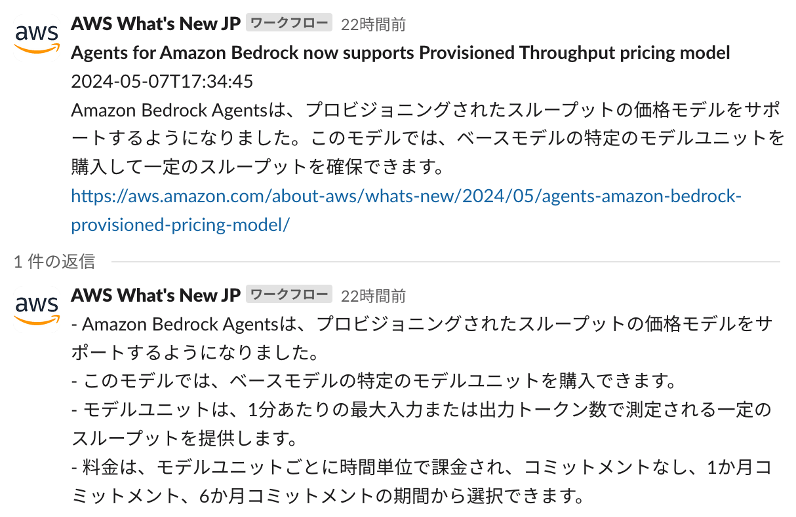
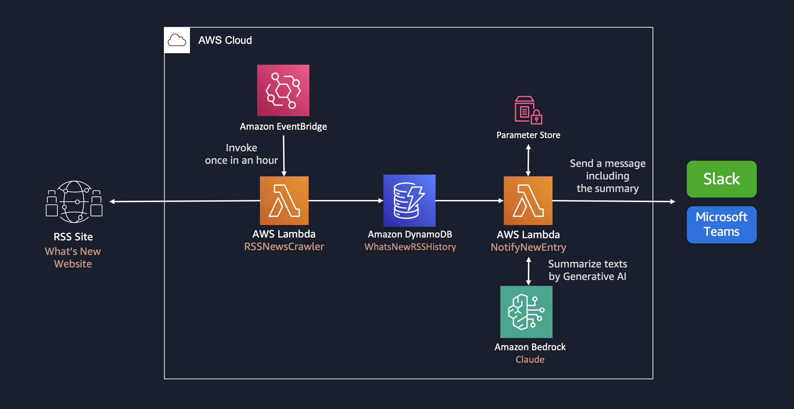

# RSS Summary Notifier

**RSS Summary Notifier** は、RSSのウェブ記事に更新があった際に記事内容を Amazon Bedrock で要約し、Slackへの配信を行う生成 AI アプリケーションです。

Amazon Samplesの[whats-new-summary-notifier](https://github.com/aws-samples/whats-new-summary-notifier)をベースに構築します。

<p align="center">
  
</p>

## 構想

1. Slack(Mattermost)へのWebHook配信を行う
2. 日時更新の静的サイトを構築し公開する。

## 予算

5 ~ 10 USD / 月を目標に設計・構築する。(1$155円計算：775 ~ 1,550円/月)

- Bedrock:
  - 1記事あたり平均4000文字と仮定し、1日100記事を要約し、100文字程度に収めるとして計算する。
  - Haikuモデルであれば月3.375ドル程度の見込み。
    - 0.00025$/1000トークン *4000トークン/1記事* 100記事 * 30日 （1文字1トークンとして計算）

## アーキテクチャ



## コードアーキテクチャ

Lambda部分の構想案。Honoを活用する。

```text
rss-summry-notifer/
├── lambda/
│   ├── aws/
│   │   ├── dynamoDB.ts
│   │   ├── bedrock.ts
│   │   ├── ssm.ts
│   ├── handlers/
│   │   ├── fetchBlogs.ts
│   │   ├── notifyBlogs.ts
│   ├── utils/
│   │   ├── rssParser.ts
│   ├── index.ts
├── .env
├── package.json
├── tsconfig.json
```

## 前提条件

- Unix コマンドを実行できる環境 (Mac、Linux、...)
  - そのような環境がない場合は、AWS Cloud9 を使用することも可能です。[操作環境の準備 (AWS Cloud9)](DEPLOY_ja.md) をご参照ください。
- aws-cdk
  - `npm install -g aws-cdk` でインストール可能です。詳しくは [AWS ドキュメント](https://docs.aws.amazon.com/cdk/v2/guide/getting_started.html)を参考にしてください。
- Docker
  - [`aws-lambda-python-alpha`](https://docs.aws.amazon.com/cdk/api/v2/docs/aws-lambda-python-alpha-readme.html) コンストラクトで Lambda をビルドするために Docker が必要です。詳しくは [Docker ドキュメント](https://docs.docker.com/engine/install/)を参考にしてください。

## デプロイ手順
>
> [!IMPORTANT]
> このリポジトリでは、デフォルトで米国東部 (バージニア北部) リージョン (us-east-1) の Anthropic Claude 3 Sonnet モデルを利用する設定になっています。[Model access 画面 (us-east-1)](https://us-east-1.console.aws.amazon.com/bedrock/home?region=us-east-1#/modelaccess)を開き、Anthropic Claude 3 Sonnet にチェックして Save changes してください。

### Webhook URL の取得

通知に必要となる Webhook URL の払い出しを行います。

#### Slack の場合

[こちらのドキュメント](https://slack.com/intl/ja-jp/help/articles/360041352714-%E3%83%AF%E3%83%BC%E3%82%AF%E3%83%95%E3%83%AD%E3%83%BC%E3%82%92%E4%BD%9C%E6%88%90%E3%81%99%E3%82%8B---Slack-%E5%A4%96%E9%83%A8%E3%81%A7%E9%96%8B%E5%A7%8B%E3%81%95%E3%82%8C%E3%82%8B%E3%83%AF%E3%83%BC%E3%82%AF%E3%83%95%E3%83%AD%E3%83%BC%E3%82%92%E4%BD%9C%E6%88%90%E3%81%99%E3%82%8B)を参考にして Webhook URL を取得してください。「変数を追加する」を選び、次の 5 つの変数をすべてテキストデータタイプで作成します。

- `rss_time`: 記事の投稿時間
- `rss_link`: 記事の URL
- `rss_title`: 記事のタイトル
- `summary`: 記事の要約
- `detail`: 記事の箇条書き説明

### AWS Systems Manager Parameter Store を作成

Parameter Store を使って 通知用の URL をセキュアに格納します。

#### パラメータストア登録 (AWS CLI)

```
aws ssm put-parameter \
  --name "/WhatsNew/URL" \
  --type "SecureString" \
  --value "<Webhook URL を入力>"
```

### 言語設定の変更 (オプション)

このアセットはデフォルトで日本語の要約を出力するように設定されています。英語等の他言語の出力を行う場合は、`cdk.json` を開き、`context` 内の `notifiers` 内の `summarizerName` を `AwsSolutionsArchitectJapanese` から `AwsSolutionsArchitectEnglish` などに書き換えてください。その他の設定オプションについては[デプロイガイド](DEPLOY_ja.md)を参照してください。

### デプロイの実行

**初期化**

このリージョンで CDK を使用したことがない場合は、次のコマンドを実行します。

```
cdk bootstrap
```

**エラーがないことを確認**

```
cdk synth
```

**デプロイの実行**

```
cdk deploy
```

## スタックの削除

不要になった場合は以下のコマンドを実行しスタックを削除します。

```
cdk destroy
```

デフォルトでは Amazon DynamoDB テーブルなど一部のリソースが削除されず残る設定となっています。
完全な削除が必要な場合は、残存したリソースにアクセスし、手動で削除を行ってください。
