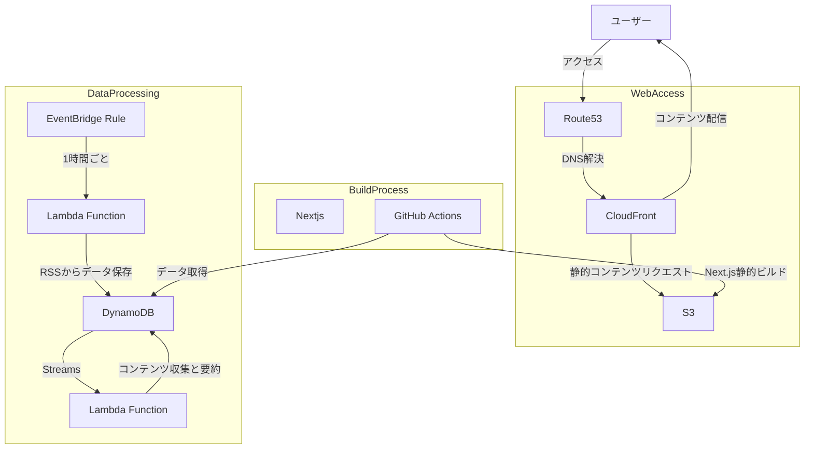

# rss-summary-notifier

企業の技術ブログやZennなどから技術系のRSSフィードを収集し、Bedrockによってコンテンツの要約を行い、DynamoDBに保存。
Next.jsでDynamoDBから取得したデータをカード風のデザインで表示するWebアプリケーション。

## 機能

- RSSフィードの収集
- コンテンツの要約
- 技術のカテゴライズ
- カード風にまとめたコンテンツの表示
- 定期的なコンテンツの更新
- 設定したコストを超えたらSlackに通知

## アーキテクチャ

## 技術スタック

- AWS (CDK)
  - S3
  - DynamoDB
  - Lambda
  - EventBridge
  - CloudFront
  - Route53
  - CloudWatch
  - Bedrock (Cloude Haiku)

- Next.js
  - Bun
  - Tailwind CSS
  - TypeScript
  - DaisyUI

- Python
- GitHub Actions

## モチベーション

- FeedlyなどのRSSリーダーが好きなので、自分でRSSリーダーを作ってみたかった
- BedrockによってRSSからAWS What's Newのコンテンツを要約し、Slackに通知するリポジトリが公開されていた
- 少し手を加えて、RSSから技術系のコンテンツを要約し、Webアプリケーションで表示することができるのではないかと考えた
- ついでにAWS CDKを使ってインフラを構築することで、インフラのコード化やそのCI/CDをGitHub Actionsで行うチュートリアルをしたかった

## 開発を止めた理由

- 技術面のやりたかったことが実現でき満足した。
- 機能としてはFeedlyの有料プランでもっと高機能なものがあるため、自分で作る必要性がない。

## UI

  

