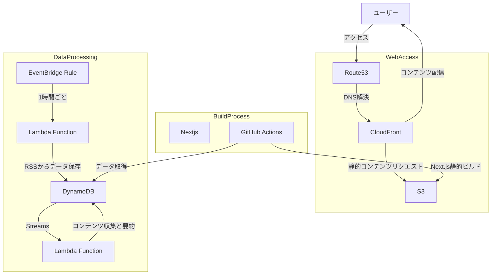

```mermaid
flowchart TD
    User[ユーザー] -->|アクセス| Route53[Route53]
    subgraph WebAccess
        direction LR
        Route53 -->|DNS解決| CloudFront[CloudFront]
        CloudFront -->|静的コンテンツリクエスト| S3[S3]
        
    end

    subgraph DataProcessing
        direction TB
        EventBridge[EventBridge Rule] -->|1時間ごと| Lambda1[Lambda Function]
        Lambda1 -->|RSSからデータ保存| DynamoDB[DynamoDB]
        DynamoDB -->|Streams| Lambda2[Lambda Function]
        Lambda2 -->|コンテンツ収集と要約| DynamoDB
    end

    subgraph BuildProcess
        direction LR
        Nextjs[Nextjs]
        GitHubActions[GitHub Actions] -->|Next.js静的ビルド| S3
        GitHubActions -->|データ取得| DynamoDB
    end

    CloudFront -->|コンテンツ配信| User

```
